# Disney Movie Quiz

Welcome to the Disney Movie Quiz! This online quiz is built using HTML, CSS and JavaScript. It's designed to test your knowledge of classic animated Disney Movies, so it appeals to all ages, from young to old. Each image and set of answers is generated from JavaScript and your score is calculated and returned on your final results page. Try again if you don't get the Disney Master ending!

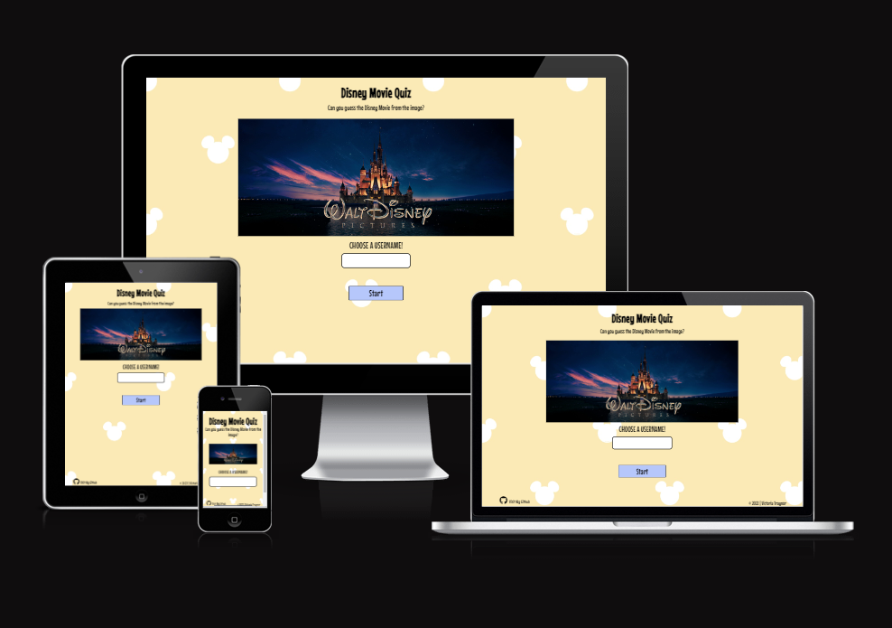

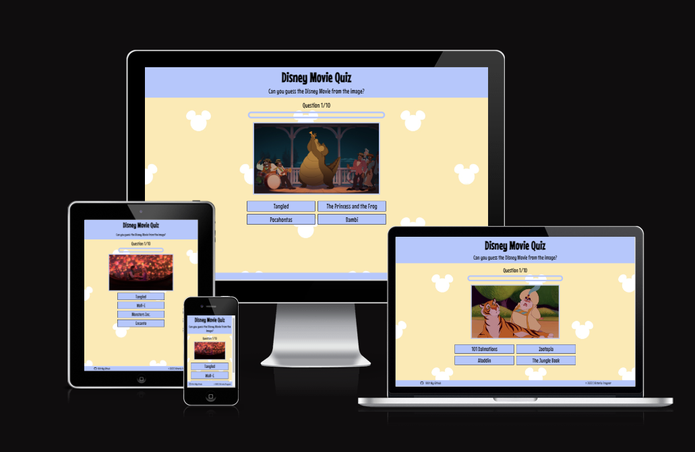

[Live link to The Disney Movie Quiz Website](https://victoriat87.github.io/disney-movie-quiz/)

 

# Table of Contents

1. [Features](#features)  
    * [Home Page](#home-page)
    * [Quiz Section](#quiz-section)
    * [Results Page](#results-page)
    * [Features Left To Implement](#features-left-to-implement)
2. [User Experience (UX)](#user-experience-ux)
    * [Site Goals](#site-goals)
    * [User Stories](#user-stories)
    * [Design](#design)
3. [Technologies](#technologies)
    * [Languages Used](#languages-used)
    * [Libraries And Frameworks](#libraries-and-frameworks)
    * [Tools and Resources](#tools-and-resources)
4. [Testing](#testing)
    * [Validator Testing](#validator-testing)
    * [Lighthouse Testing](#lighthouse-testing)
    * [Other Testing](#other-testing)
5. [Bugs Found and Fixed](#bugs-found-and-fixed)
    * [Bugs Not Fixed](#bugs-not-fixed)
6. [Credits And Sources](#credits-and-sources)
7. [Deployment](#deployment)
8. [Acknowledgements](#acknowledgements)

# Features 

## Existing Features

### Home Page

  - The Home Page features a splash image of the Disney Pictures Logo which is instantly recognizable. This will allow visitors to the site to know the quiz is built around Disney Movies.

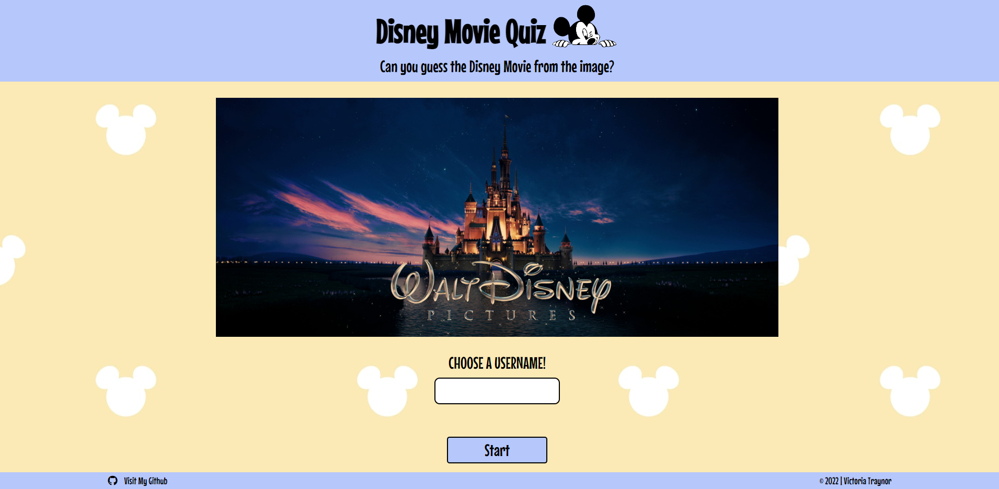
   

### Header and Footer
  - Across all pages, a header and footer appear. The Header contains a H1 and paragraph, displaying the name of the quiz, as well as a description of what it's about. There is also an image of Mickey Mouse to further show the Disney relation.
  - The Footer contains a link to my Github, with a FontAwesome icon and a copyright.
  - Both the header and footer are within a flexbox, for great responsiveness across all devices and screen sizes.

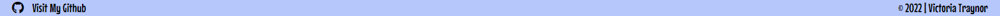
 

### Username Validation
  - On the Index page, there is a username input form. This is validated through JavaScript, and only allows a username between 3 and 8 characters long. It will throw an error is the input field is empty, contains whitespace or is too long.

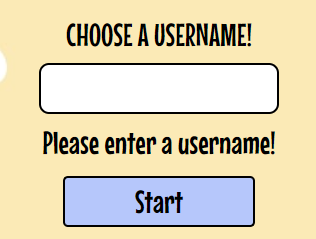
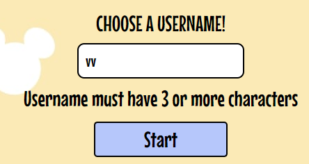

 

### Quiz Section

  - The Quiz Section will run when the User enters a Username and it's validated.
  - The Quiz contains an image of a classic Disney Movie pulled from an array of questions in script.js, a counter to show which question the user is on, a progress bar (on larger screens) and 4 buttons that are generated purely in JavaScript.
  - The Quiz container is a Flexbox, which allows for great responsiveness, and prevents the quiz from falling out of place when resized. 

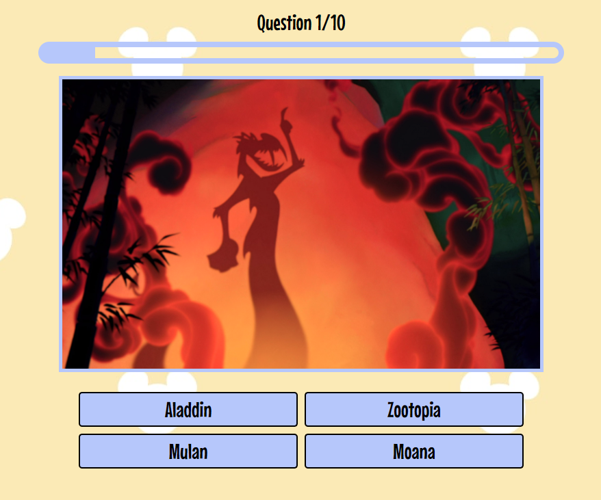

 

### Quiz Buttons

 - The Quiz buttons are all generated through JavaScript. The inner text will pull from the question array and display on each button.
 - The buttons have a hover effect, which is a transparency to allow the body background image shine through.

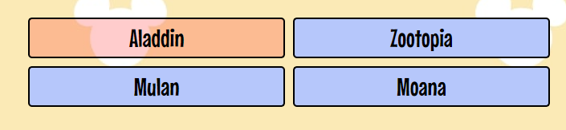

 - When an answer is selected, the correct answer will turn a shade of green and the incorrect ones will turn a shade of red. The selected answer will also highlight with a blue border to match the border of the quiz.

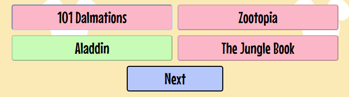

 

### Results Section

  - The Results Section will automatically show when the user has finished answering all 10 questions.
  - The results show as a paragraph with a score marked out of the total questions. The score is calculated through JavaScript and increments each time an answer is selected. There are 3 possible paragraphs of text to return, depending on the score the user received.
  - After the results div, there is a restart button. This reloads the quiz and resets all scores and the username.

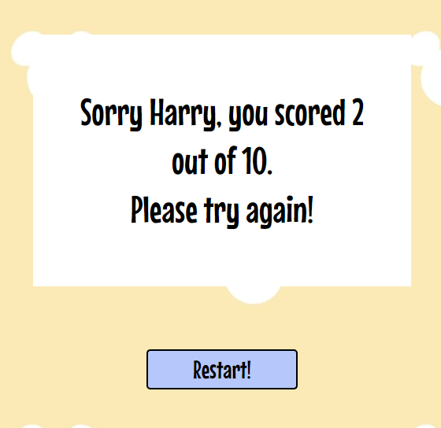
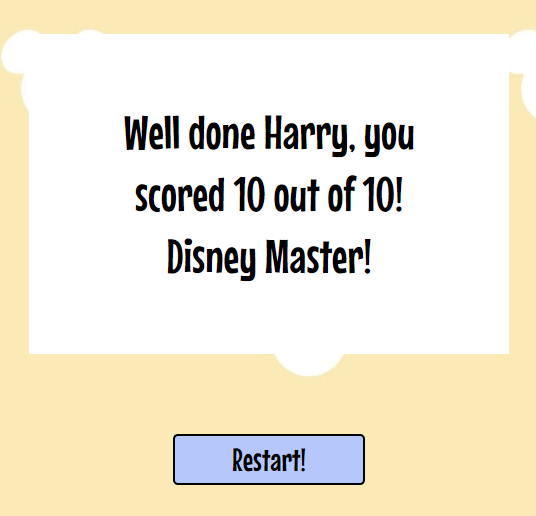

 

## Features Left to Implement

- Adding more questions, so there is a larger pool of possible questions and answers to pull from would give the quiz more replayability. As there are
- Give an option to share the quiz and results on social media, to generate more interest in it.
- Adding a timer to each question. This would make sure people weren't cheating by googling the answer.

 

[Back to Top](#table-of-contents)

 

# User Experience (UX)

## Site Goals
The main goal of the website is to encourage visitors, disney fans and movie fans to enjoy a quick quiz on Classic Disney Movies. The images are from movies that released between 1990 and 2020, so the quiz is fun for a large range of ages. The purpose of having different ending result paragraphs is to encourage users to retry the quiz and better their score.

## User Stories

* Users will:

  * Understand that the website is a Disney Movie quiz, based on images.
  * Be able to easily use the website, on desktop and mobile.
  * Return to the home page at any time.
  * Retry the quiz easily once they finish.
  * See their results in an easy to read manner.
  * See the Developers information and GitHub (in an external tab).

 

## Design

### Colour Scheme
 -   The colour scheme was selected once I found a background that suited the fun style of the quiz and linked into Disney. When this was found, I used the [Canva](https://www.canva.com/colors/color-wheel/) website to find complimentary colours based on the pale yellow of the background. This lead me to the pale blue for the header, footer and buttons. Once these were in place, I also used the Canva site to find Analogous colours to match the correct and incorrect colors for each button.

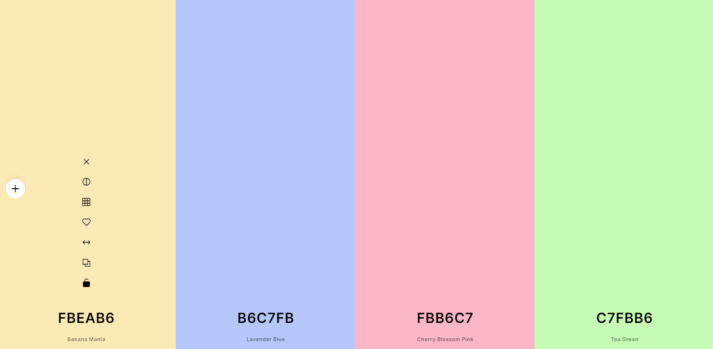

### Typography
 -   The font chosen for the website is a font called Mouse Memoirs. This was picked because it was developed from inspiration of the classic Disney font from the 1950's and 60's. It also has good clarity on both desktop and mobile screens. The font was found on [Google Font](https://fonts.google.com/specimen/Mouse+Memoirs) and imported to the website with a CSS import.

### Wireframe
 - My first step in creating the website was to create a wireframe using [Balsamiq](https://balsamiq.com/). Below is the image.
 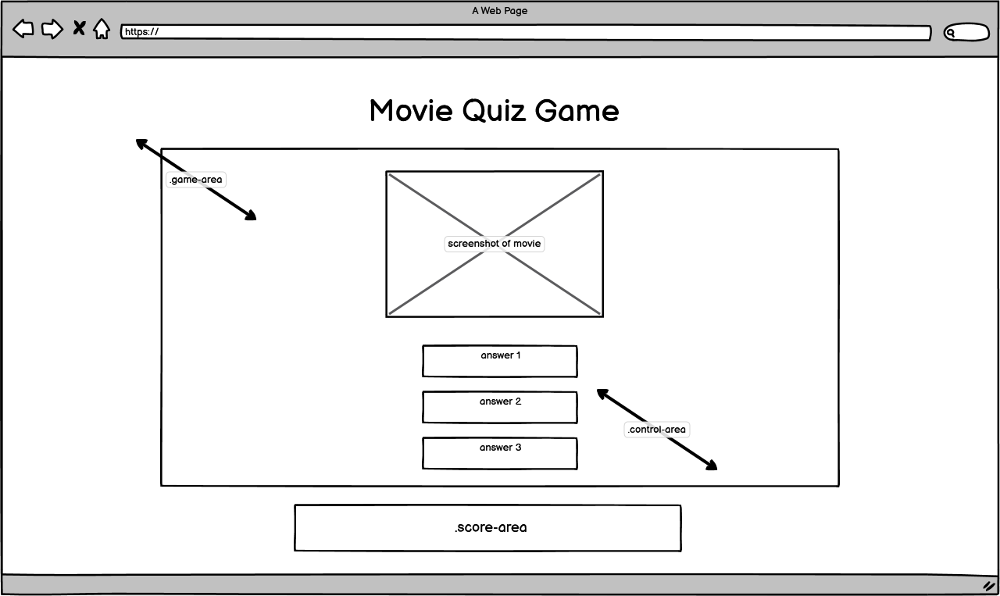

 

[Back to Top](#table-of-contents)

 

# Technologies

## Languages Used
* [HTML5](https://www.w3schools.com/html/)
* [CSS](https://www.w3schools.com/css/)
* [JavaScript](https://www.w3schools.com/js/)

## Libraries And Frameworks
* [Google Fonts](https://fonts.google.com/)
* [Font Awesome](https://fontawesome.com/)

## Tools And Resources
* [GitPod](https://www.gitpod.io/)
* [GitHub](https://github.com/)
* [ReadMe Template](https://github.com/Code-Institute-Solutions/readme-template)
* [PicResize](https://picresize.com/)
* [Balsamiq](https://balsamiq.com/)
* [WEBP Converter](https://cloudconvert.com/webp-converter)
* [Am I Responsive](https://ui.dev/amiresponsive)
* [W3C HTML Validation](https://validator.w3.org/)
* [W3C CSS Validation](https://jigsaw.w3.org/css-validator/)
* [Lighthouse](https://web.dev/measure/)
* [Chrome DevTools](https://developer.chrome.com/docs/devtools/)
* [Flexbox](https://css-tricks.com/snippets/css/a-guide-to-flexbox/)
* [Stack Overflow](https://stackoverflow.com/)
* [Favicon.io](https://favicon.io/)

 

[Back to Top](#table-of-contents)

 

# Testing 
### Validator Testing 

- HTML
  - No errors were returned when passing through the official [W3C validator](https://validator.w3.org/)
- CSS
  - No errors were found when passing through the official [(Jigsaw) validator](https://jigsaw.w3.org/css-validator/)
- JavaScript
  - No errors were returned when passing through [JSHint](https://jshint.com/)

* Metrics Returned:

    * There are 19 functions in this file.

    * Function with the largest signature take 2 arguments, while the median is 0.

    * Largest function has 11 statements in it, while the median is 3.

    * The most complex function has a cyclomatic complexity value of 4 while the median is 1.

    * 34 Warnings appear but are all the following:
    	- 'const' is available in ES6 (use 'esversion: 6') or Mozilla JS extensions (use moz).
      - 'let' is available in ES6 (use 'esversion: 6') or Mozilla JS extensions (use moz).
      - 'arrow function syntax (=>)' is only available in ES6 (use 'esversion: 6').
      -	'template literal syntax' is only available in ES6 (use 'esversion: 6').

Other Warnings included;
* Missing Semicolons - these were all corrected.

* Undefined Variables - these were removed as all were found to be unnecessary to the functions.

### Lighthouse Testing
 - When tested on desktop, performance for the website is 100 across all categories. 
  
  
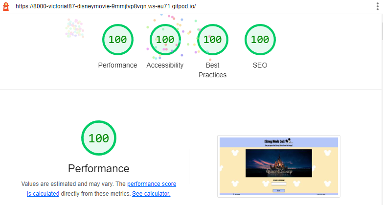

 - The recommendations from Lighthouse for this issue was to change images from .jpg to .webp. To do this, I used the website [WEBP Converter](https://cloudconvert.com/webp-converter). After running Lighthouse again, this changed to a 99.
 - The other recommendations Lighthouse gave me to speed up performance, was to do with the caching of images. I tried to research this issue but it was to do with the configuration of the server, and adding "Cache-Control" to the server header. As I don't have access to this, I could not change it.

 

  

 - Lighthouse was also used on the Contact Page. When first tested, this gave an Accessibility rating of 97. The reason given for this was because the iFrame for the embedded Google Map did not have a title. This was added and the report returned 100.

  

  

 - Best Practices was set at a 92 for each page. Reading the error, it was coming from the site.webmanifest used in the Favicon. Researching this lead me to understand that I needed to add crossorigin="use-credentials" to this link tag. This corrected all the errors and returned 100 across all pages in Lighthouse.

 

  

 - Report on mobile, when the hero image was present, gave an 82 performance score. This was to do with a Large Contentful Paint - the loading of the image. I decided to remove it from mobile versions.

 

### Other Testing
 - The website has been tested across various screen sizes, using the Chrome DevTools responsive device section and by opening the website on Firefox, Chrome, 3 various sized Android phones (Huawei P20 Lite, OnePlus 9 Pro, Samsung Galaxy S20) and an Android tablet (Samsung Galaxy Tab A8). 

  

 - Huawei P20 Lite Vertical 
  

 

- Huawei P20 Lite Horizontal
 

 

- Samsung Tab A8 Vertical
 

 

- Samsung Tab A8 Horizontal
 

 

- One Plus 9 Pro Horizontal
 

 

- One Plus 9 Pro Horizontal

 

- One Plus 9 Pro Vertical Hamburger Menu
 

 

 

- One Plus 9 Pro Vertical Fixtures Section
 

 

[Back to Top](#table-of-contents)

 

# Bugs Found and Fixed
- Originally, I was using divs, positioning and floats to layout all content. However, when resizing, I ran into major issues with how the content positioned itself. After discussing with my Mentor, he advised me to learn and use [Flexbox](https://css-tricks.com/snippets/css/a-guide-to-flexbox/) elements instead.

- The Hero Image, when resizing, was leaving a gap between the Header and the image itself. I had assumed this was to do with either the height on the image or the padding on the wrapper. I wrote media queries for both using Chrome DevTools but this didn't solve the issue. After trouble shooting on Stack Overflow, I noticed that my image didn't have "background-size: cover". When this was added, the image no longer had a gap when resizing.

- The Cover Text on the Hero image was positioned using floats but when resized, the text would float below the image. This was because I had originally positioned it using pixels. After changing this to % values, the cover text stayed in place when the screen was resized.

- The original code I used to make the Hamburger menu from [makeuseof.com](https://www.makeuseof.com/responsive-navigation-bar-using-html-and-css/) and [https://codepen.io/](https://codepen.io/bloom-dan/pen/vKdoaM) gave me an error when I ran it through the W3 Validation. It said "an input can't be a child of a UL".  After asking for help in the Slack Channel,  fellow student, Sean Johnson, messaged me to say he also had the same issue. After talking through his code and comparing it to mine, I realised I needed to move the Checkbox Input from under the UL to under the nav class itself. This also meant I needed to change the CSS to point to the new sibling of the menu, instead of a child of the UL.

- The layout of my Fixtures section and my League Table section, when resized, were overflowing the Flexbox. This was because I had set the height using vh units. After testing in Chrome DevTools, the solution to this issue was to change from using vh units, to using em units. 

- Errors returned by Lighthouse when testing the Contact Form page, showed me that there was something wrong with the site.webmanifest link in the Head. This link was automatically generated by [Favicon.io](https://favicon.io/) along with my favicon images. When looking up information about this error, I came across an atricle on [Medium.com from Aurélien Delogu](https://medium.com/@aurelien.delogu/401-error-on-a-webmanifest-file-cb9e3678b9f3) which showed me what the error was and how to fix it. The solution was to add "crossorigin="use-credentials" on the link tag.

- Another Lighthouse error on the Contact Page was about the iFrame that contained my embedded Google Map. This HTML was auto-generated by Google and added to my website, however the error was telling me it needed a title. I tried to read some information on the Google Map website but found none. I eventually found a website called [Deque University](https://dequeuniversity.com/rules/axe/4.4/frame-title) which explained that for screen readers to be able to identify this iFrame, it needed a title attribute added to the iFrame html.

- The logo.webp image inside the Flexbox for Fixtures, was giving an arror in Lighthouse as not having a width and height attribute. This did originally have the width and height, as the same image does in the Header, however it then lowered my Lighthouse "Best Practices" score to 92, as it was giving me the error "Image display dimensions should match natural aspect ratio". I thought this had to do with the width of the flexbox element itself. I tried to give the div both a larger and smaller percentage of the Flex container, however neither of these fixed the issue. I then realised I had given the image itself some CSS attributes with min-height. When this was removed, the error resolved.

 

# Bugs Not Fixed

 - Report on mobile, when the hero-image was present, gave an 82 performance score. This was to do with a Large Contentful Paint - the loading of the image. At first, my research lead me to believe I needed to add a pre-load to the header, so the image was loaded at a high priority. This however, only pushed the performance up to an 87. I then tried to resize the hero-image, so it would not take as much time to load but again, this didn't help the performance. In the end, I decided to just remove the image from displaying on mobile.

 

[Back to Top](#table-of-contents)

 

# Credits and Sources

- Website was built using the [Code Institute Template](https://github.com/Code-Institute-Org/gitpod-full-template)
- The Football Trophy image in the News Section, is taken from [Unsplash.com](https://unsplash.com/photos/exqr-l9rr94?utm_source=unsplash&utm_medium=referral&utm_content=creditShareLink) by photographer [Darque Kj](https://unsplash.com/@darquekj).
- Hamburger menu code was a written with code from [MakeUseOf.com](https://www.makeuseof.com/responsive-navigation-bar-using-html-and-css/), [bloom-dan on CodePen.io](https://codepen.io/bloom-dan/pen/vKdoaM) and my fellow student [Sean Johnson](https://code-institute-room.slack.com/U03790U1LAV).
- Back to the Top Button from [W3Schools](https://www.w3schools.com/howto/howto_js_scroll_to_top.asp)
- Form CSS was adapted from [The Love Running Project](https://github.com/Code-Institute-Solutions/love-running-2.0-sourcecode)
- Code to fix the error "Ensure all frame and iframe elements have valid title attribute values.", was found on [Deque University](https://dequeuniversity.com/rules/axe/4.4/frame-title)
- The solution to the Lighthouse error about site.webmanifest failing to load (adding crossorigin to the link) was found on [Medium.com from Aurélien Delogu](https://medium.com/@aurelien.delogu/401-error-on-a-webmanifest-file-cb9e3678b9f3)
- The drone image of the pitch on the Contact Form was taken by JP Traynor, my brother. He gave his permission for the image to be used in this project.
- All other images were used with thanks to Anne Traynor, my mother, who started Shanganagh Cliffs F.C. as part of her Community Work - the images were all taken by her within the first few years of the start of the SCFC community project.
- Table data for the League Table was populated from [The A.U.L. website](http://www.aul.ie/competition.aspx?oid=1001&id=1291#.Yxttw3bMKUk)

 

[Back to Top](#table-of-contents)

 

# Deployment

The following are the steps I went through to deploy my live site:

- The site was deployed to GitHub pages. The steps to deploy are as follows: 
  - In the GitHub repository, navigate to the Settings tab on the top menu.
  - From the settings page, navigate to the Pages section from the left hand side menu.
  - From the source section drop-down menu, select "Deploy From a Branch"
  - Press the save button.
  - After a few minutes, you can refresh the page to see your Live Site link at the top.

The live link can be found here - https://victoriat87.github.io/shanganagh-cliffs-fc/

 

[Back to Top](#table-of-contents)

 

# Acknowledgements
- To my amazing boyfriend Thomas. For listening to me worry about this project for months, for editing the Contact Form background image to look extra beautiful, and for keeping me sane. 
- My brother JP for all his QA work on the website and for the beautiful drone shot of the football pitch.
- My family and my cats for keeping my stress levels under control!
- My Mentor [Jubril Akolade](https://github.com/Jubrillionaire) for all the help and for pointing me towards Flexbox. His help and guidance was invaluable.
- Sean Finn and Sean Johnston, my fellow classmates on Slack. Your help with my many questions was super appreciated, thank you.

 

[Back to Top](#table-of-contents)